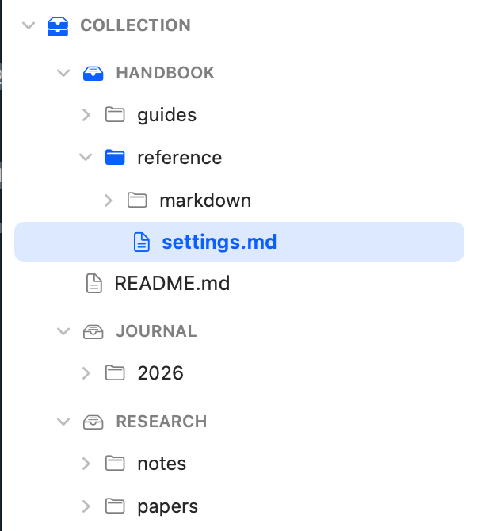
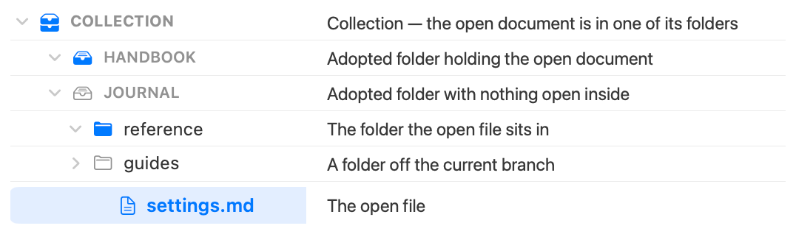

# EditMD

Native Markdown editor for macOS. SwiftUI + AppKit/TextKit, no Electron, no web
views for editing — the markdown string is the single source of truth, and
everything else is a view of it.

Website: [dotmd.tools/editmd](https://dotmd.tools/editmd), part of the
[dotMD.tools](https://dotmd.tools) family.

## Three modes, one document

- **Source** — raw markdown with syntax highlighting, lint hints, and
  display-only table alignment that never touches the bytes.
- **Visual** — WYSIWYG attributed-text editing with synchronous, loss-free
  serialization back to markdown on every keystroke: tables, math, images,
  wiki-links, code blocks.
- **Preview** — offline HTML rendering (KaTeX math, highlight.js code,
  interactive task checkboxes, in-page find), plus a live split view with
  synced scrolling (⌥⌘P).

## Features

- **Workspace sidebar** — folders and standalone files, outline, git status and
  per-file history, tags, full-text search. Folders group into named
  collections, and the branch holding the open document is marked all the way
  down — so where you are is legible without reading a single name.
- **Wiki-links** — `[[link]]` completion, backlinks, a persistent link index,
  vault lint (dead links, orphans), and a frontmatter properties panel.
- **Review marks** — inline comment threads stored in a sidecar file, rendered
  in all modes.
- **Agent integration** — works as an IDE for [Claude Code](https://claude.com/claude-code)
  over WebSocket/MCP (open files, follow the agent's edits, approve diffs), and
  ships `editmdctl`, a CLI that answers vault-graph queries (backlinks, search,
  outline, lint) even when the app is not running.
- **Also**: PDF export, PDF/image viewer, smart paste (tables from
  Excel/Numbers, images, URLs), textbundle assets, English/Russian UI.



The mark follows the open document rather than the folders you happened to
expand: everything above it is filled, and the folder it actually sits in is
accented.



## Install

```bash
brew install --cask andryushkin/apps/editmd
```

Or download the DMG from the
[latest release](https://github.com/andryushkin/editmd/releases/latest). The
app is Developer ID signed and notarized; macOS 14 (Sonoma) or newer.

EditMD checks once a day whether a newer version exists and says so when there
is one — updating itself stays manual (`brew upgrade`, or replacing the app).
The check can be turned off in Settings ▸ General, and `Check for Updates…` in
the EditMD menu asks on demand.

## Build

Requires macOS 14+, Xcode 26+ (Swift 6.2), and
[XcodeGen](https://github.com/yonaskolb/XcodeGen).

```bash
xcodegen generate --spec EditMD/project.yml
xcodebuild -project EditMD/EditMD.xcodeproj -scheme EditMD -destination 'platform=macOS' build
xcodebuild -project EditMD/EditMD.xcodeproj -scheme EditMD -destination 'platform=macOS' test
```

`EditMD/project.yml` is the source of truth for the Xcode project — edit it and
regenerate rather than touching the `.xcodeproj`.

## Repository notes

This is a personal project developed largely with AI agents. `CLAUDE.md` and
`AGENTS.md` are the agent working guides, and [`docs/`](docs/README.md) holds
domain documentation (architecture, vault, review, integration, testing)
written for humans and agents alike.

## Contributing

Bug reports and ideas are the contributions that help most: bugs go to
[Issues](https://github.com/andryushkin/editmd/issues), ideas and questions to
[Discussions](https://github.com/andryushkin/editmd/discussions).
[CONTRIBUTING.md](CONTRIBUTING.md) has the details, including the deliberately
narrow pull-request policy.

## License

[MIT](LICENSE). Bundled third-party components (KaTeX, Open Sans, highlight.js
via HighlighterSwift, and others) are listed in
[THIRD_PARTY_NOTICES.md](THIRD_PARTY_NOTICES.md).
